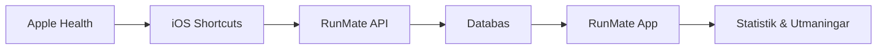

# iOS Shortcuts Integration för RunMate

## 🎯 Vad användare kan få

### Träningsdata som kan exporteras:
- **Löpträning**: Distans, tid, pace, hjärtfrekvens
- **HRV**: Hjärtvariabilitet för återhämtning  
- **Sömn**: Sömntid och kvalitet från Apple Watch
- **Steg**: Dagliga stegräkningar
- **VO2 Max**: Konditionsdata

## 🚀 Implementation för RunMate

### Steg 1: Backend API Endpoint
```javascript
// backend/routes/health.js
router.post('/apple-health/import', protect, async (req, res) => {
  try {
    const { workouts, heartRate, steps, sleep } = req.body;
    
    // Konvertera Apple Health workouts till RunMate format
    const activities = workouts.map(workout => ({
      title: `${workout.workoutType} - Apple Health`,
      distance: workout.totalDistance?.value || 0,
      duration: Math.round(workout.duration / 60), // sekunder till minuter
      startTime: new Date(workout.startDate),
      avgHeartRate: workout.metadata?.averageHeartRate || null,
      calories: workout.totalEnergyBurned?.value || 0,
      source: 'apple_health',
      userId: req.user._id
    }));

    // Spara alla aktiviteter
    const savedActivities = await Activity.insertMany(activities);
    
    // Uppdatera användarstatistik
    await updateUserStats(req.user._id);
    
    res.json({ 
      imported: savedActivities.length,
      activities: savedActivities 
    });
    
  } catch (error) {
    res.status(500).json({ message: error.message });
  }
});
```

### Steg 2: iOS Shortcut Template

```
Shortcut: "Synka till RunMate"

1. Find Health Samples
   - Sample Type: Workouts
   - Sort by: Start Date (Newest First)  
   - Limit: 10
   - Get samples from: Last 7 Days

2. Get Contents of URL
   - URL: https://staging-runmate-backend-production.up.railway.app/api/health/apple-health/import
   - Method: POST
   - Headers: 
     * Authorization: Bearer [USER_TOKEN]
     * Content-Type: application/json
   - Request Body: 
     {
       "workouts": [Formatted Health Samples],
       "timestamp": [Current Date]
     }

3. Show Notification
   - Title: "RunMate Sync"
   - Body: "Importerade X träningspass"
```

## 📲 Användarupplevelse

### Manual Sync (Fas 1):
1. **Öppna Shortcuts-appen**
2. **Kör "Synka till RunMate"**  
3. **Bekräfta behörigheter** (första gången)
4. **Se bekräftelse**: "3 träningspass importerade!"

### Automatisk Sync (Fas 2):
1. **Ställ in automation**: Varje dag kl 08:00
2. **Helt automatisk**: Ingen användarinteraktion
3. **Push-notifiering**: Vid framgång eller fel

## 🔧 Teknisk Implementation

### Apple Health Data Format:
```json
{
  "workouts": [
    {
      "workoutType": "HKWorkoutActivityTypeRunning",
      "startDate": "2024-01-15T07:30:00Z",
      "endDate": "2024-01-15T08:15:00Z", 
      "duration": 2700,
      "totalDistance": {
        "value": 5.2,
        "unit": "km"
      },
      "totalEnergyBurned": {
        "value": 420,
        "unit": "kcal"
      },
      "metadata": {
        "averageHeartRate": 165,
        "source": "Apple Watch"
      }
    }
  ]
}
```

### RunMate API Response:
```json
{
  "imported": 3,
  "activities": [
    {
      "_id": "...",
      "title": "Löpning - Apple Health",
      "distance": 5.2,
      "duration": 45,
      "calories": 420,
      "source": "apple_health"
    }
  ]
}
```

## 🎨 UI Integration i RunMate

### Inställningssida:
```jsx
// Settings för Apple Health
<div className="bg-white rounded-2xl p-6">
  <h3 className="font-semibold mb-4">🍎 Apple Health</h3>
  
  <button 
    onClick={() => window.open('https://runmate.app/shortcuts')}
    className="btn btn-primary w-full mb-3"
  >
    📱 Ladda ner iOS Shortcut
  </button>
  
  <div className="text-sm text-gray-600">
    <p>✅ Automatisk synkronisering av träningspass</p>
    <p>✅ Hjärtfrekvens och HRV-data</p> 
    <p>✅ Sömn och återhämtningsmetrik</p>
  </div>
</div>
```

## 📊 Möjlig Data-Flow



## 🚀 Fördelar för RunMate

1. **Ingen iOS-app behövs**: Fungerar med befintlig webb-app
2. **Automatisk import**: Träningspass synkas automatiskt  
3. **Rik data**: HRV, sömn, puls - inte bara basic träningsdata
4. **Användarens integritet**: All data via Apple's säkra API:er
5. **Bred kompatibilitet**: Fungerar med alla Apple Health-kompatibla appar

## 📋 Implementation Checklist

- [ ] Skapa `/health/apple-health/import` endpoint
- [ ] Bygg iOS Shortcut template
- [ ] Lägg till UI i Settings för att ladda ner shortcut
- [ ] Testa med riktiga Apple Health-data
- [ ] Dokumentera för användare
- [ ] Lansera som beta-feature 